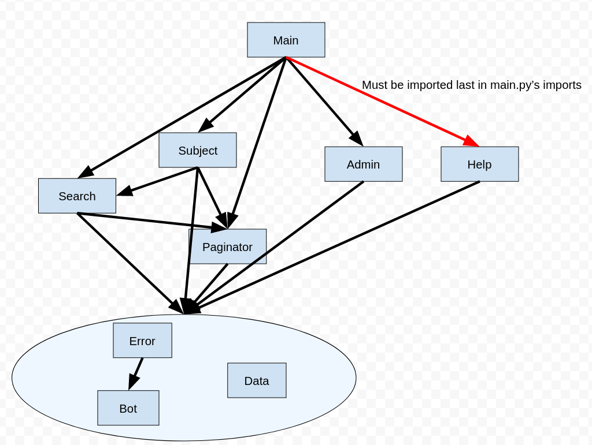

# Unimelb helper

This is a discord bot to search for subjects and display related information.  

## Main commands  
### ?subject
A much faster search engine than the handbook's search engine, and arguably better, producing less unwanted results. Also displays information about subjects in a fairly pretty way.
### ?reqfor
This is like the requisites page in the handbook, but in reverse. Now you can search for what subjects use a certain subject as a prerequisite!

## Setup
If you don't want to setup the bot and just want to see it in action, head on over to https://discord.gg/NjNrjNNazD where it lives. It is currently deployed on heroku.   
Otherwise, follow the following tutorial in order to setup a bot, and get a private token.
https://discordpy.readthedocs.io/en/stable/discord.html
To run this bot, simply set the UNIMELB_HELPER_TOKEN environment variable to the bot's private token, and run bot/main.py from the same directory as this readme.

## The web scraper
This required quite a bit of web scraping, as you may see in one-off-scripts/scraper.py  
That is now a huge monolithic spaghetti monster that needs to be rewritten in the near future. Essentially there's a couple well-written functions that write to a global subjects dict assuming the corresponding entries exist, but the mechanics of retrieving each subject's HTML is extremely messy and there's a bunch of edge cases cause web scraping is a pain.
data/prefixes.json stores server prefixes depending on the server.

## The scraped data
Check out the data folder, and have fun. I hope it is of use, and if there is some data you would like scraped and added to the database, feel free to put an issue and I will get to it (It is a futile endeavour trying to understand how the scraper works, and adding to the database yourself xd.)

## The search engine
The search engine works by ranking first on the match category. Let our query string be "q". For example, if x is a subject such that q is a prefix of x's sujbect code, and y is a subject such that q is a substring of y's title, then x will be ranked before y. These match categories are pretty well documented in bot/search.py  
Hence, match is basically a heuristic for "search relevance".  
Then, matches are sorted by "popularity". For now, I've used "number of studentVIP reviews as a heuristic for popularity.

## Deployment
I'm really not sure how I set it up a few months ago. I think you should be able to just follow the steps blindly on heroku and whisper the magic words: `git push heroku master` and everything will all be sorted out by past Quang's mess of procfiles.

## Import diagram.

